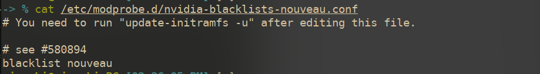
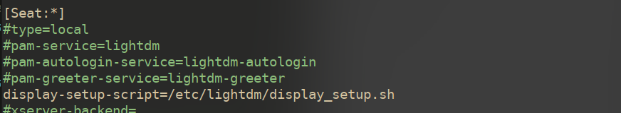
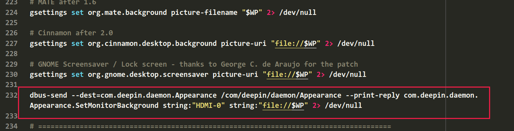

# linux操作简录

## 依赖包安装


## 开发环境与工具


## 安全设置


## 双显卡设置

禁用nouveau



在使用了集显与独显的电脑上，安装操作系统时选择安装独显n卡驱动，或者安装系统以后安装nvidia驱动，使用官方源中集成的n卡驱动即可

```shell
sudo apt install nvidia-driver nvidia-smi
```

随后编辑xorg配置文件/etc/X11/xorg.conf

```conf
Section "Module"
    Load "modesetting"
EndSection

Section "Device"
    Identifier "nvidia"
    Driver "nvidia"
    BusID "PCI:1:0:0"      
    Option "AllowEmptyInitialConfiguration"
EndSection

Section "Screen"
	Identifier "nvidia"
	Device "nvidia"
EndSection
Section "Device"
    Identifier "intel"
    Driver "modesetting"
EndSection

Section "Screen"
    Identifier "intel"
    Device "intel"
EndSection

```

编辑启动配置脚本/etc/lightdm/display_setup.sh

```sh
#!/bin/sh
xrandr --setprovideroutputsource modesetting NVIDIA-0
xrandr --auto
xrandr --dpi 96
```

在lightdm配置文件中添加该脚本/etc/lightdm/lightdm.conf



## UI美化

### 壁纸

使用工具variety，自动切换壁纸，并且可以添加图片特效

不同的操作系统设置壁纸的命令不同，variety可能会出现设置壁纸无效的情况，解决办法是搜索当前操作系统设置壁纸的指令，添加到variety设置壁纸的脚本中

```
~/.config/variety/scripts/set-wallpaper
```

deepin v20设置壁纸的指令为

```shell
dbus-send --dest=com.deepin.daemon.Appearance /com/deepin/daemon/Appearance --print-reply com.deepin.daemon.Appearance.SetMonitorBackground string:"屏幕名称" string:"file:///图片路径"
```

我的屏幕名称为HDMI-0

在set-wallpaper脚本后添加



variety即可进行正常的壁纸切换任务

### 标题栏高度

.local/share/deepin/themes/deepin/light/titlebar.ini

```ini
[Active]
height=24

[Inactive]
height=24
```

.local/share/deepin/themes/deepin/dark/titlebar.ini也进行一样的编辑